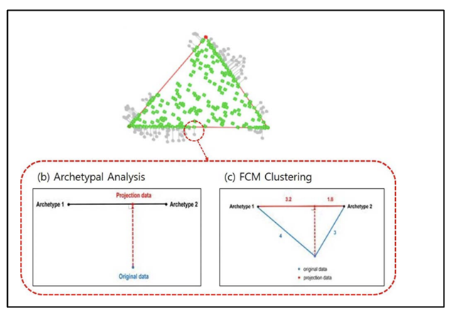
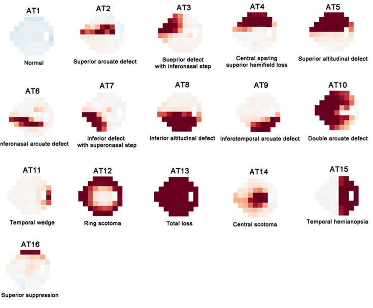
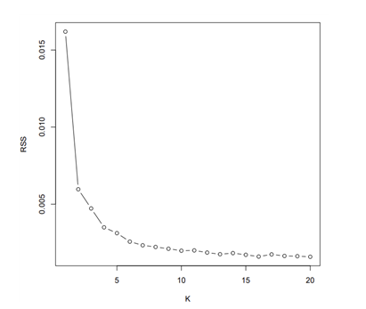
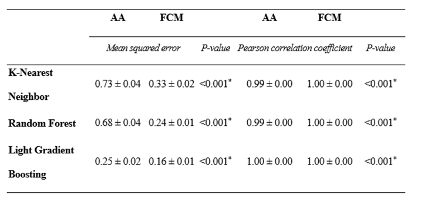

# glaucoma_VF                                  
- This study is based on a hybrid artificial intelligence technique that combines archetypal analysis (AA) and fuzzy c-means (FCM) clustering. The objective is to minimize the projection loss that occurs when visual field tests are analyzed solely using archetypal analysis. By doing so, the method aims to analyze and classify visual field tests without any loss of information.

    
- After excluding visual field tests with low reliability, we use Archetypal Analysis (AA) to determine 16 representative archetypes (AT) with low reconstruction error. Subsequently, we cluster visual field test data into these 16 AT using Fuzzy C-Means (FCM) clustering. By decomposing individual patients' visual field tests into these 16 AT, we can measure the coefficients that indicate how much each AT contributes to a specific patient's visual field pattern. This allows us to present representative patterns. Furthermore, by analyzing changes in AT ratios, we can analyze the progression of glaucoma based on visual field test patterns.
    
  
## Data
* TDV values of patients with glaucoma or suspected glaucoma. (We used data from 132,938 patients.)
  When conducting the analysis, two sets are required:
  - one with 52 columns *(1)* and another with 54 columns *(2)*. 
  - The set with 52 columns involves removing blind spot areas from the 54-column TDV dataset. 
 
## Prerequisites
* python 3.6
* R studio 4.1.1

## Archetype Analysis
1. download the 'Archetype.R' file from GitHub.
2. Modify the code with the desired analysis file name.
   - Reference: The file for analysis should be formatted as follows: N X 52 ---- *(1)*  
     The blind spot TDV needs to be removed.

|PID|TDV1|TDV2|...|TDV54|
|------|---|---|---|---|
|patient1| | | | |
|patient2| | | | |
|...| | | | |
|patient N| | | | |
     
4. Modify to the desired number of representative archetypes (AT). We have chosen 16. (You can refer to the RSS graph.)

    
5. You will obtain 'parameter' file and 'AA coefficient' file.

## Fuzzy C-means
1. download the 'FCM.py' file from GitHub.
2. Add blind spots to columns 26 and 35 of the TDV file used in Archetype.R. 
   Fill these columns with a value of 0.
   - Reference: The file for analysis should be formatted as follows: N X 54 ----- *(2)*  
     The blind spot TDV needs to be removed.
     
|PID|TDV1|TDV2|...|TDV54|
|------|---|---|---|---|
|patient1| | | | |
|patient2| | | | |
|...| | | | |
|patient N| | | | |
     
3. Modify the path of 'TDV54_path' in the 'config.yaml' file.
4. Add columns with zero values at positions 26 and 35 in the parameter file generated from Archetype analysis, and update the param54_path in the config.yaml file.
5. Adjust the coef.columns in the code to match the number of representative archetypes (AT) you have configured.
6. You will obtain 'FCM coefficient' file.

## Visualization
1. Modify the path for 'FCM_coef' in 'config.yaml' to match the path where the 'FCM coefficient' were created in FCM.py.
2. Set the number of iterations in the 'decomposition function' according to the number of representative archetypes (AT) you have chosen.
3. You can obtain the proportion of each archetype (AT) for each patient. An example can be found in the visualization folder.

## Slope
1. Use the folder containing 'FCM coefficients', 'AA coefficients', 'MD (Mean Deviation)', and 'VFI (Visual Field Index)' for patients who have undergone testing at least 5 times.
   - Reference: The file for analysis should be formatted as follows:
     
|PID|ExamDate|FCM_coef16|...|FCM_coef16|AA_coef1|...|AA_coef16|MD|VFI|
|------|---|---|---|---|---|---|---|---|---|
|patient1| 2019-07-12| | | | | | | | |
|patient2| | | | | | | | | |
|...| | | | | | | | | |
|patient N| | | | | | | | | |       
         
2. You will obtain 'FCM slope', 'AA slope', 'MD slope', 'VFI slope'

## KNN, lightGBM, RF, SVM and paired t-test
1. Utilize data from patients who have undergone testing at least 2 times.
2. The data file should include AA coefficients and FCM coefficients.
3. Modify the path for 'coeff_path' in the 'config.yaml' file.
4. If FCM coefficients are the target of analysis, then change x_col to x_col_FCM in the code X = data[col['x_col']].
5. You will use files generated from KNN, lightGBM, RF, and SVM for paired t-tests.
    

